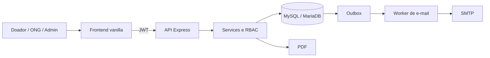

# Food Rescue

Plataforma full-stack que conecta estabelecimentos com alimentos excedentes a ONGs locais, reduzindo desperdício e registrando o ciclo completo da doação.

> MVP de portfólio funcional em ambiente local. Consulte [Limites atuais](#limites-atuais) antes de considerar uma implantação pública.

## Destaques

- Perfis de doador, ONG e administrador com RBAC.
- Cadastro de estabelecimentos e lotes de alimentos.
- Solicitação, reserva e confirmação de resgate.
- Transações MySQL com `SELECT ... FOR UPDATE` contra reserva dupla.
- bcrypt, JWT, refresh token rotativo e revogação de sessões.
- Verificação de e-mail e recuperação de senha com tokens de uso único.
- E-mails assíncronos com Outbox, comprovantes e relatórios PDF.
- Auditoria, pseudonimização de documentos e minimização de dados.
- Frontend responsivo em JavaScript, HTML5 e CSS3.
- Testes do fluxo crítico com Playwright.

## Arquitetura



## Stack

| Camada | Tecnologias |
|---|---|
| Backend | Node.js, Express, MySQL2, Zod |
| Segurança | bcrypt, JWT, Helmet, CORS, rate limiting |
| Banco | MySQL 8 ou MariaDB/XAMPP, InnoDB |
| Frontend | JavaScript vanilla, HTML5, CSS3 |
| Documentos | PDFKit e Nodemailer |
| Qualidade | Node Test Runner e Playwright |

## Fluxo principal

1. Doador e ONG criam contas e estabelecimentos.
2. O doador publica um lote.
3. A ONG solicita o resgate.
4. O doador reserva atomicamente o lote.
5. Uma das partes confirma a entrega.
6. A plataforma gera o PDF, audita e enfileira as notificações.

## Instalação local com XAMPP

Requisitos: Node.js 20+, npm e MySQL/MariaDB.

1. Inicie o MySQL no XAMPP.
2. Execute `database/schema.sql` no phpMyAdmin.
3. Execute, em ordem, `database/migrations/002_outbox_eventos.sql` e `003_auth_sessions.sql`.
4. Prepare a aplicação:

```powershell
npm install
Copy-Item .env.example .env
npm run dev
```

5. Troque as chaves de exemplo no `.env` e abra [http://localhost:3000](http://localhost:3000).

O `.env` nunca deve ser versionado. SMTP é opcional no desenvolvimento; todas as opções estão em `.env.example`.

## Administrador local

Cadastre uma conta e execute:

```sql
USE food_rescue;
UPDATE usuarios SET perfil = 'admin' WHERE email = 'seu-email@exemplo.com';
```

Saia e entre novamente para renovar o perfil contido no JWT.

## API

Prefixo: `/api/v1`.

| Área | Exemplos |
|---|---|
| Autenticação | `/auth/cadastro`, `/auth/login`, `/auth/refresh`, `/auth/logout` |
| Estabelecimentos | `/estabelecimentos`, `/estabelecimentos/meus` |
| Lotes | `/lotes` |
| Resgates | `/lotes/:id/solicitacoes`, `/solicitacoes/:id/reserva` |
| Confirmação | `/solicitacoes/:id/confirmacao`, `/solicitacoes/:id/comprovante` |
| Administração | `/admin/metricas`, `/admin/usuarios`, `/admin/auditoria` |

Mais detalhes em [`docs/api-rest.md`](docs/api-rest.md).

## Testes

```powershell
npm test
npm run test:e2e
```

O E2E cobre cadastro, estabelecimentos, lote, solicitação, reserva, confirmação, PDF, RBAC e rotação/revogação de sessão.

## Estrutura

```text
database/       DDL e migrations
docs/           arquitetura e material de portfólio
e2e/            testes Playwright
output/pdf/     documentos de exemplo
public/         frontend responsivo
src/            API, regras, PDF e worker
test/           testes rápidos
```

## Segurança e privacidade

- Senhas com bcrypt e tokens opacos persistidos somente como hash.
- CPF/CNPJ pseudonimizado com HMAC; o valor em claro não é persistido.
- Verificação de perfil e propriedade no servidor.
- PDF entregue por endpoint autenticado.
- Logs sem senhas, documentos ou tokens.
- `.env`, dependências e relatórios de testes ignorados pelo Git.

Consulte também [`SECURITY.md`](SECURITY.md).

## Limites atuais

Antes de uso público, são necessários HTTPS, SMTP e infraestrutura gerenciada, backups, observabilidade, rate limiting compartilhado, política formal de retenção LGPD, idempotência persistida, testes de carga e revisão independente de segurança.

## Licença

Licença MIT. Consulte [`LICENSE`](LICENSE).
